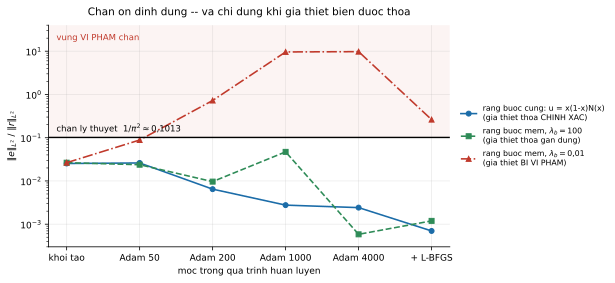
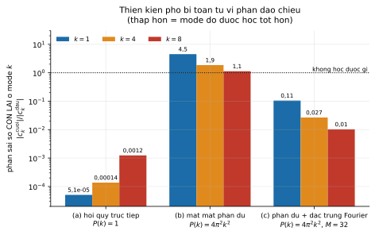

# Theoretical Foundations of Neural Networks and PINNs

[](https://github.com/tu-h-nguyn/foundations-of-neural-networks-and-pinns-for-differential-equations/actions/workflows/ci.yml)
[](https://www.python.org/)
[](LICENSE)
[](code/tests/)
[](code/verify_results.py)
[](code/pinns/core.py)

A thesis on **why physics-informed neural networks fail**, and a from-scratch PyTorch
implementation that tests every claim it makes. No PINN library is used — the whole
method is about 900 lines built directly on `torch.autograd`, so that nothing the
argument depends on is hidden inside someone else's abstraction.

The thesis does not treat the failures as anecdotes. It locates **three independent
causes, sitting at three different levels** — approximation, optimisation, and the
stability of the differential problem itself — and shows they conspire on exactly the
class of problems with a small length scale. Six experiments with **pass/fail criteria
fixed in advance** then check each one.

<p align="center">
  
</p>

<p align="center">
  <em>Why minimising a residual is worth doing at all: a stability bound guarantees
  <strong>‖e‖ ≤ π⁻²‖r‖</strong>, so a small residual really does mean a small error.
  With the boundary condition imposed exactly (blue), the bound holds at every
  milestone. Weaken the hypothesis far enough (red) and the bound is exceeded by up to
  96×. The guarantee is only as good as its hypothesis.</em>
</p>

---

## What is in this repository

| | |
|---|---|
| **`code/pinns/`** | The method, written from scratch: `core.py` (150 lines — network, autodiff derivatives of arbitrary order, Adam/L-BFGS, gradient-imbalance diagnostics) plus one script per experiment. |
| **`code/verify_results.py`** | Re-derives **every published number** from `code/results/*.json`. Run by CI. |
| **`code/tests/`** | 20 unit tests that check the primitives against closed-form mathematics, not against themselves. |
| **`Sections/`, `main.tex`** | The thesis (Vietnamese), ~7 600 lines of LaTeX. |
| **`code/results/`** | Committed JSON output of all six experiments — the numbers the text quotes. |

## The idea, and where it breaks

A PINN represents the solution of a differential problem by a network $u_\theta$ and
minimises the residual of the equation itself at a set of collocation points:

$$
J_r(\theta) = \frac{1}{N}\sum_{i=1}^{N}
\bigl|\mathcal{L}u_\theta(x_i) - f(x_i)\bigr|^2 ,
\qquad
J = J_r + \lambda_b J_b .
$$

The thesis studies the feed-forward network through derivatives **with respect to its
input** rather than its parameters — the opposite of what general deep-learning texts
do, and the right choice here, because $\mathcal{L}$ differentiates in $x$. Explicit
recurrences for the Jacobian and Hessian fall out, and from them an immediate
*necessary* condition on the activation function.

That condition is what makes the ReLU case sharp. For a second-order operator the
residual objective is not merely harder to optimise — it is **locally constant**, so
every gradient-based algorithm is exactly stationary. Not slow: stationary.

## Results

Each experiment had its success criterion written down before it was run.

| | Experiment | What it tests | Result |
|---|---|---|---|
| **TN1** | activation degeneracy | ReLU under a 2nd-order operator | $\nabla J_r = 0$ **exactly**; $J_r$ never moves from 776,229 — the mean of $f^2$ over the grid. tanh reaches $6{,}0\times10^{-5}$, i.e. **16 660× better** |
| **TN2** | cost of a soft constraint | boundary error vs $\lambda_b$ | measured exponent **−0,910** against the predicted $\lambda_b^{-1}$ (9% off); optimal $\lambda_b$ is **finite**, not $\infty$ |
| **TN3** | spectral bias | does the operator change which modes are learned first? | **yes, it reverses it** — see below |
| **TN4** | diffusion equation | absolute accuracy, value of L-BFGS | $\varepsilon_{L^2} = 1{,}0\times10^{-4}$; L-BFGS improves on Adam in every configuration |
| **TN5** | Burgers, small viscosity | the hard case | **negative result** — no configuration beats $\varepsilon_{L^2} = 0{,}082$ |
| **TN6** | stability bound | $\|e\| \le \pi^{-2}\|r\|$ | holds at every milestone when the hypothesis is met (max ratio 0,0261 vs bound 0,1013); **exceeded 96×** when it is not |

### Spectral bias is reversed by the operator

Fit the same target three ways — same architecture, same seed, same data — and the
order in which frequencies are learned flips:

<p align="center">
  
</p>

Plain regression shows textbook spectral bias: the $k=8$ mode retains **24× more** of
its initial error than $k=1$. Switch to the residual loss and the ordering inverts —
now it is the **lowest** frequency that is left behind, by a factor of 4. The mechanism
is visible in the loss: the operator $-\mathrm{d}^2/\mathrm{d}x^2$ multiplies mode
$k$ by $4\pi^2k^2$, so the residual weights high modes by $k^4$ and drags them
forward.

This mattered more than a plot. It **contradicted the thesis's own Chapter 4**, which
had concluded that a PINN is least accurate at exactly the frequencies it learns
slowest. The published text keeps the experiment and retracts the claim: the effective
spectrum has *two* competing factors, the chapter had argued each separately and then
tacitly assumed the second one wins. In the moderate-frequency band the first one wins.
The proved propositions stand; joining them into a prediction about learning order was
the overreach.

### The negative result, and what came out of it

Burgers at small viscosity is the case the theory says should be hard, and it is — the
reference solution reaches $\max|u_x| = 150$. Worse, the standard fix makes it worse.
Adaptive weight annealing drives $\lambda_b$ to $1{,}9\times10^{4}$ and
$1{,}1\times10^{5}$, and the final error **degrades from 0,082 to 0,39 and 0,35** —
four times worse than leaving the weights alone. Chasing the imbalance amplifies it.

Rather than omit this, the thesis proves why: the annealing rule has a **positive-feedback
regime**, a lemma that exists only because the experiment failed.

## Reproducibility, measured rather than asserted

Every experiment pins a seed and runs in `float64`. **That is not enough for
digit-for-digit reproduction**, and the repository says so with data instead of
disclaimers.

The first attempt at pinning this down was wrong, and CI caught it. Re-running
TN1 at 1, 2 and 4 BLAS threads *on one machine* suggested that everything not
passing through an optimisation trajectory reproduced bit-for-bit. On GitHub's
runners — different CPU — three of those quantities immediately disagreed. Thread
count is not the only thing that reorders a summation: a different CPU selects
different SIMD kernels, and reorders it again. The measurement had varied one
factor and concluded it was the only one.

What survives that correction is a sharper and smaller claim:

| | reproduces bit-for-bit | why |
|---|---|---|
| ReLU's \$u_{xx}\$ and \$\nabla J_r\$; the parameter count | **yes, on any machine** | these are not sums at all — \$\sigma''\equiv 0\$ makes them structural zeros, and a parameter count is an integer |
| one forward/backward pass (init derivatives, the dead ReLU net's error) | to ~1 ulp | floating-point, but with no trajectory to accumulate along |
| tanh quantities after 4 000 Adam steps | no — up to 3,4% | epsilon-sized differences amplified along the optimisation trajectory |

So `verify_results.py` deliberately does **not** do `git diff --exit-code` on the
results, which would look rigorous and would go red on any machine at all. It
checks 39 items at the precision each one actually supports:

- **closed-form identities**, to machine precision — e.g. the mean of \$f^2\$ is
  \$8\pi^4\$, and the value ReLU's dead network is stuck at is the grid mean of
  \$f^2\$, matched to \$10^{-12}\$;
- **internal consistency** — the \$\lambda_b\$ exponent is re-fitted from the rows,
  all 36 error ratios are recomputed from their own components, and TN1 and TN2
  are checked to be bit-identical where they share a run;
- **inequalities and signs** — the \$\pi^{-2}\$ bound, the monotonicity of the
  boundary error, the negative Burgers result;
- **a real re-run** of TN1, in the three tiers above, reporting the largest
  deviation it saw so the next recalibration uses measurements rather than
  guesses.

The gate was mutation-tested: corrupting a ratio, or setting the fitted exponent to the
theoretically expected −1, is caught.

## Running it

```bash
make install        # editable install + dev dependencies
make test           # 20 unit tests
make verify         # re-derive every published number (seconds)
make verify-rerun   # the same, plus re-running TN1 from scratch (~1 min)
make experiments    # re-run all six experiments (slow; rewrites code/results/)
make thesis         # build main.pdf (needs a TeX distribution with XeLaTeX)
```

Individual experiments:

```bash
cd code
python -m pinns.exp1_relu      # activation / ReLU degeneracy
python -m pinns.exp2_lambda    # cost of the soft constraint
python -m pinns.exp3_spectral  # spectral bias and its reversal
python -m pinns.exp4_heat      # diffusion equation
python -m pinns.exp5_burgers   # Burgers, small viscosity
python -m pinns.exp6_stability # the stability bound
```

See [`code/README.md`](code/README.md) for the conventions that tie the code to the
thesis's notation, and for the full thread-count measurements.

## AI transparency

Built with Claude (Anthropic) as an assistant. Roughly half the commits carry a Claude
co-author trailer — the current count is not a number to take on trust either:

```bash
git log --format=%B | grep -ci 'Co-Authored-By: Claude'   # vs: git rev-list --count HEAD
```

Scope:

- **The thesis is mine** — the theory, the proofs, and the argument it makes.
- **The AI-assisted commits are editing and reruns.** Compile errors, missing captions
  and bibliography entries, clearing overfull boxes, tightening several proofs and
  unifying notation in Chapters 2–3, and re-running experiments 3, 4 and 5 with the
  configurations the text specifies. Later: the test suite, `verify_results.py`, the
  figures on this page, and the packaging and CI.
- **What is checked rather than asserted.** Every claim above is re-derived by
  `make verify` in CI, so it can be checked rather than taken on trust.

## Citing

See [`CITATION.cff`](CITATION.cff). Code is MIT-licensed ([`LICENSE`](LICENSE));
the thesis text and figures are the author's.
