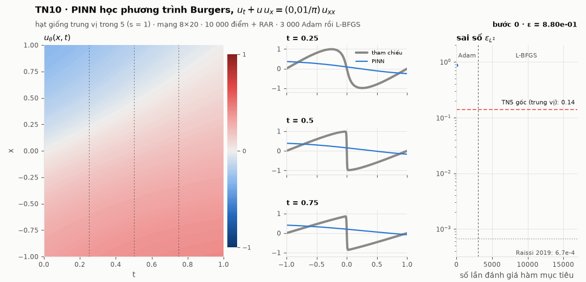
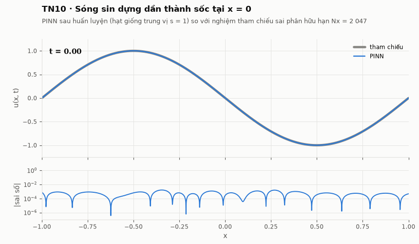
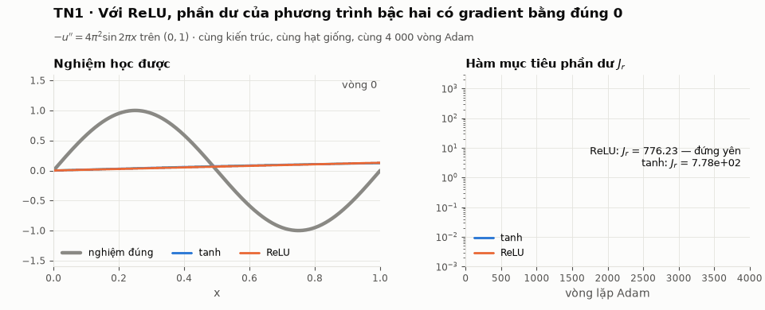
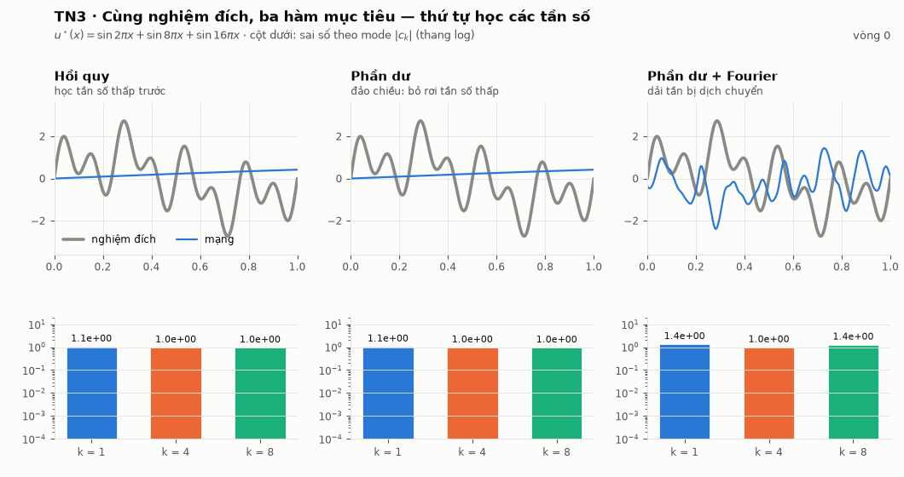

# Cơ sở lý thuyết về mạng nơ-ron và phương pháp PINNs cho phương trình vi phân

**Báo cáo Giải tích số** · Nguyễn Hoàng Tú (23110220) · GVHD: TS. Ông Thanh Hải
Khoa Toán – Tin học, Trường ĐH Khoa học Tự nhiên, ĐHQG-HCM

<p align="center">
  
</p>

<p align="center"><em>
Một PINN học phương trình Burgers độ nhớt nhỏ, từ khởi tạo ngẫu nhiên tới sai số
L² tương đối <b>6,48·10⁻⁴</b> — hạt giống <b>trung vị</b> trong năm, không phải hạt
giống đẹp nhất.
</em></p>

---

## Báo cáo này làm gì

Xây dựng PINNs từ gốc — mạng nơ-ron, định lý xấp xỉ, vi phân tự động bậc cao,
hàm mất mát phần dư — rồi **kiểm chứng từng phát biểu lý thuyết bằng mười thí
nghiệm** viết bằng PyTorch thuần (không dùng thư viện PINN đóng gói), mỗi thí
nghiệm có tiêu chí thành bại đặt ra *trước khi* chạy.

Luận điểm trung tâm: PINNs suy giảm trên bài toán có thang độ dài nhỏ vì **ba
nguyên nhân độc lập ở ba tầng khác nhau** — tầng ổn định (hằng số suy biến theo
1/ν), tầng tối ưu (bệnh lý gradient) và tầng xấp xỉ (thiên kiến phổ). Và điều
quan trọng hơn: **chữa được** — Thí nghiệm 10 áp dụng đúng các biện pháp mà báo
cáo tự đề xuất.

## Kết quả nổi bật

| | Kết quả | Thí nghiệm |
|---|---|---|
| 🚀 | **Burgers: 1,38·10⁻¹ → 6,48·10⁻⁴**, tốt hơn **213 lần** (trung vị 5 hạt giống, mọi hạt giống trong [3,85·10⁻⁴; 8,33·10⁻⁴]) — cùng mức với công trình gốc Raissi và cs. (2019), 6,7·10⁻⁴ | TN10 |
| ⚡ | Mạng **ReLU có gradient phần dư bằng đúng 0** tới từng chữ số máy → điều kiện σ ∈ Cᵐ là *bắt buộc*, không phải khuyến nghị | TN1 |
| 🔄 | Toán tử vi phân **đảo chiều thiên kiến phổ**: hồi quy học tần số thấp trước, PINN thì ngược lại — 5/5 hạt giống | TN3 |
| 🩺 | Chỉ số mất cân bằng gradient phân biệt bài toán cứng và lành: max ρ_b ∈ [603; 4 070] (Burgers) so với [19,5; 96,5] (khuếch tán), **hai khoảng không giao nhau** | TN5, TN8 |
| 🧮 | Ủ trọng số (Wang và cs.) **làm xấu 10/10 lần chạy** → báo cáo chứng minh một bổ đề mới về chế độ phản hồi dương của quy tắc ấy | TN4, TN5 |
| ⚖️ | Nói thẳng: ở bài toán 1D thuận, PINN **chậm hơn sai phân hữu hạn ~10⁴ lần** ở cùng độ chính xác (1,8·10⁴ ở mức TN5; 1,1·10⁴ ở mức TN10: 39 phút so với 0,21 giây). Giá trị của PINN nằm ở bài toán ngược, dữ liệu khuyết, số chiều cao — không ở tốc độ | TN9, TN10 |

## Xem nó xảy ra

### Thí nghiệm 10 — nghiệm PINN so với nghiệm tham chiếu theo thời gian

<p align="center">
  
</p>

Sóng sin dựng đứng thành một lớp sốc dày cỡ 10⁻² tại x = 0 (độ dốc 150 tại
t = 0,5). PINN bám được cả lớp sốc. Ở cả năm hạt giống, sai số lớn nhất nằm trong
lớp sốc; dải sốc chỉ chiếm 1,4% diện tích nhưng chứa khoảng một nửa (trung vị 51%)
bình phương sai số — nửa còn lại là mức nền ~10⁻⁴ trên vùng trơn (panel dưới, thang
log; tính ở độ chính xác kép từ trọng số đã lưu).

### Thí nghiệm 1 — ReLU đứng yên, tanh hội tụ

<p align="center">
  
</p>

ReLU có đạo hàm bậc hai bằng 0 hầu khắp nơi, nên với phương trình bậc hai, phần
dư *không phụ thuộc tham số* — mạng không có gì để học.

### Thí nghiệm 3 — thứ tự học bị đảo chiều

<p align="center">
  
</p>

Hồi quy thông thường học tần số thấp trước (thiên kiến phổ). Thêm toán tử −d²/dx²
thì trọng số phổ nhân thêm k⁴ và thứ tự **đảo ngược**: sai số dồn về mode thấp.

## Mười thí nghiệm

| # | Câu hỏi | Kết luận |
|---|---|---|
| TN1 | σ phải trơn tới đâu? | ReLU hỏng chính xác như Hệ quả dự báo |
| TN2 | Ràng buộc mềm tốn gì? | λ_b tối ưu là hữu hạn (λ_b = 100, 5/5 hạt giống) |
| TN3 | Thiên kiến phổ có chuyển sang PINN? | Có, nhưng **đảo chiều** |
| TN4 | Bài toán lành (khuếch tán) | ρ_b nhỏ, ủ trọng số vẫn làm xấu |
| TN5 | Bài toán cứng (Burgers ν = 0,01/π) | ρ_b lớn hai bậc; sai số 1,4·10⁻¹ với ngân sách nhỏ |
| TN6 | Chặn ổn định ‖e‖ ≤ π⁻²‖r‖ có đúng? | Đúng trên bốn bậc ‖r‖; bị vi phạm gấp 96 lần khi biên chỉ thoả lỏng (λ_b = 0,01) |
| TN7 | Hằng số ổn định có suy biến theo 1/ν? | Chỉ đo được ở ν vừa phải — nêu thẳng giới hạn |
| TN8 | Cái gì sống sót qua 5 hạt giống? | Mọi kết luận định tính; loại bỏ 4 con số |
| TN9 | PINN tốn bao nhiêu? | c = 2,67 ≤ 3 (khớp); đồ thị bậc hai ×8,4 (ước lượng cũ thấp) |
| **TN10** | **Áp dụng chính các biện pháp khắc phục thì sao?** | **213× tốt hơn TN5, sai số 6,48·10⁻⁴** |
| TN10b | Trong 213× ấy, RAR đóng góp bao nhiêu? (tách biến, 3 nhánh × 5 hạt giống) | Chỉ ~2% (thang log), không nhất quán; tác dụng thật là **cục bộ** tại sốc |
| TN10c | Lấy mẫu lại toàn bộ (RAD) có tránh được đánh đổi của RAR? (3 giả thuyết đặt trước) | **Không**: H1, H2 không đạt, H3 đạt; mọi chiến lược thích nghi làm vùng trơn tệ đi **15/15** |

## Trung thực về con số

- **Không có số nào được chỉnh tay.** Mọi con số trong báo cáo và README đọc từ
  `code/results/*.json`, sinh bởi mã trong `code/pinns/`.
- Hoạt hình Burgers dùng hạt giống **trung vị**, không phải hạt giống đẹp nhất.
- TN10 đổi **bốn** thứ cùng lúc so với TN5 (mạng sâu hơn, 4× điểm phối trí, L-BFGS
  dài hơn, RAR). Thí nghiệm tách biến **TN10b** rẽ ba nhánh từ cùng một trạng thái
  (RAR / thêm điểm ngẫu nhiên cùng số lượng / không thêm) và cho thấy:
  - trên ε_L², RAR chỉ thắng "không thêm" ở **3/5** hạt giống (trung vị 6,48 so với
    7,18·10⁻⁴) — mức cải thiện 213× đến gần như hoàn toàn từ mạng + số điểm + L-BFGS;
  - thêm điểm **ngẫu nhiên** không giúp gì → vấn đề không phải số lượng điểm;
  - tác dụng thật của RAR là **cục bộ**: sai số lớn nhất tại sốc giảm ở 4/5 hạt giống,
    phần sai số trong dải sốc 79% → 51%, đổi lại vùng trơn tệ đi nhẹ.
  Nhánh RAR khớp TN10 **từng bit** trên cả 5 hạt giống.
- Báo cáo từng dự đoán rằng lấy mẫu lại toàn bộ, có giữ mật độ vùng trơn (RAD,
  Wu và cs. 2023), sẽ tránh được sự đánh đổi ấy. **TN10c** kiểm dự đoán này với ba
  giả thuyết ghi vào mã nguồn *trước khi chạy*, và dự đoán **sai**: RAD (c = 1)
  chỉ thắng "không thêm" ở 2/5 hạt giống và làm vùng trơn tệ đi ở 5/5. Kết luận
  vững nhất của cả chuỗi: ba chiến lược thích nghi đều làm vùng trơn tệ hơn tập
  điểm cố định ở **15/15** lần so sánh — ở cấu hình này, cách đặt điểm chỉ
  *phân phối lại* sai số.
- Tái lập từng chữ số cần cố định cả hạt giống **lẫn** `OMP_NUM_THREADS=1`
  (số luồng BLAS một mình nó đổi sai số Burgers 1,7 lần — xem `code/README.md`).

## Cấu trúc kho

```
main.tex, preamble.tex, titlepage.tex   báo cáo (XeLaTeX + biber)
Sections/                               các chương 0–6 và phụ lục
Images/                                 hình tĩnh; Images/anim/ là GIF hoạt hình
slides/                                 slide beamer; slides/anim/ là khung hình PDF
code/pinns/                             mã thí nghiệm TN1–TN10 và animate.py
code/results/                           số liệu thô (JSON)
```

## Tái lập

```bash
# Báo cáo và slide
latexmk -xelatex main.tex
cd slides && latexmk -xelatex slide.tex      # hoạt hình chạy trong Adobe Reader / Okular

# Thí nghiệm
cd code && pip install -r requirements.txt
export OMP_NUM_THREADS=1
python -m pinns.exp1_relu                    # ... tới exp9_chiphi
for s in 0 1 2 3 4; do python -m pinns.exp10_burgers_manh $s & done; wait
python -m pinns.exp10_burgers_manh tong_ket
for s in 0 1 2 3 4; do python -m pinns.exp10b_rar_tachbien $s & done; wait
python -m pinns.exp10b_rar_tachbien tong_ket  # tách biến RAR (~2 giờ)
for s in 0 1 2 3 4; do python -m pinns.exp10c_rad $s & done; wait
python -m pinns.exp10c_rad tong_ket           # RAD, in DAT / KHONG DAT cho H1–H3
python -m pinns.animate tat_ca               # dựng lại toàn bộ GIF và hình TN10
```

Một hạt giống TN10 mất khoảng 39 phút trên một lõi CPU, và cho lại kết quả **giống từng bit** khi chạy lại với cùng `OMP_NUM_THREADS=1`.
